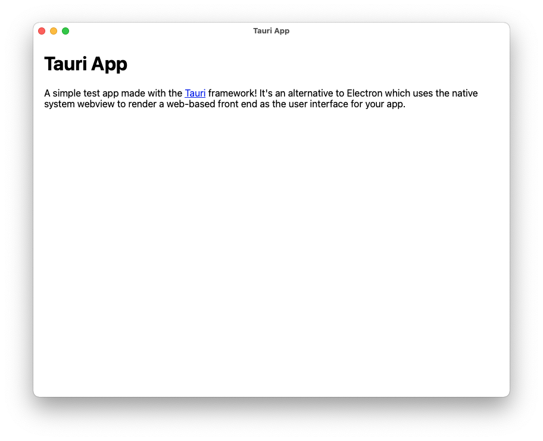
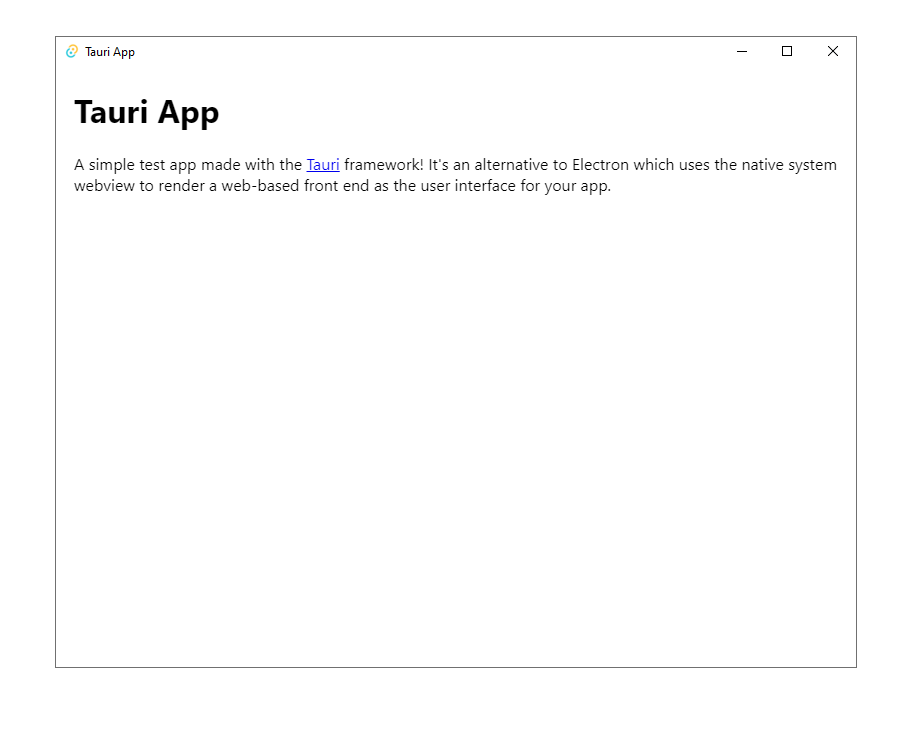

# Tauri App

A simple test app made with the [Tauri](https://tauri.app/) framework! It's an alternative to Electron which uses the native system webview to render a web-based front end as the user interface for your app.

